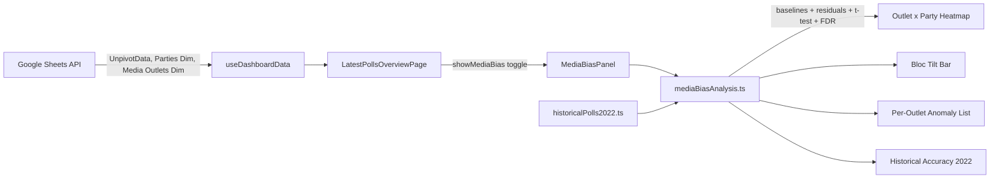

# Media Bias Panel — Specification

## Overview

Add a "Media Bias" view inside `poll-tracker-app` that quantifies each outlet's house effects vs a 30-day rolling cross-outlet baseline, flags statistically significant tilts (BH-FDR), highlights per-outlet historical anomalies (z-scores), and visualizes per-outlet Coalition/Opposition bloc tilt. Augmented with an informational "2022 Track Record" badge per outlet (MAE + Coalition Bloc Error) computed from the user-provided final 2022 polls vs actual results.

This document is the canonical spec. Implementation details (signatures, control ranges, formatting rules) are normative — UI copy is suggestive.

---

## Methodology

### Baseline (shared for both questions)

For each party `p` and date `d`, compute a **30-day rolling cross-outlet mean** seat count from `UnpivotData` (all outlets pooled). Then for every row, define:

```
residual(outlet, party, date) = outletSeats − rollingBaseline(party, date)
```

This is the standard "house effect" formulation and absorbs real trend changes (war, ceasefire, coalition events) so a tilt is measured relative to what *other outlets* were saying at the same time.

### Threshold Exemption (3.25% / 4-seat boundary)

Israel's electoral threshold (3.25%) instantly grants 4 seats once crossed. So a poll moving an outlet's number from 4 to 0 (or 0 to 4) is mostly a discretization artifact, not real bias. We compute **two residuals per row**:

- `rawResidual = outletSeats − baseline` — the true seat difference; used for the **heatmap color scale and tooltips** so users see the actual jump.
- `statResidual` — the dampened residual used for **σ, μ, z-scores, t-tests, p, and pAdj**. Computed as:

```
A (false death):       outletSeats === 0 AND baseline > 0 AND baseline <= 5
B (false resurrection): outletSeats >= 4 AND outletSeats <= 5 AND baseline < 1
if (A or B): statResidual = (outletSeats - baseline) / 4
else:        statResidual = outletSeats - baseline
```

This prevents threshold-driven jumps from inflating standard deviations and producing false anomaly flags for parties hovering near the threshold (e.g. `Balad`, `Hadash Ta'al`, `Ra'am`, `Blue & White`).

### Joint Arab List handling

Some outlets report the Arab parties as a single `Joint Arab List` line; others split them into `Hadash Ta'al` + `Ra'am`. Comparing the union to the individual parties produces meaningless residuals.

We pre-process `UnpivotData` into a synthetic, harmonized party `Arab List (combined)`:

- For every poll, define `arabSeats = jointArabListVotes if jointArabListVotes > 0 else (hadashTaalVotes + raamVotes)`.
- The synthetic party replaces all three (`Joint Arab List`, `Hadash Ta'al`, `Ra'am`) in the analysis layer.
- `Balad` is kept separate (it has run independently in this period).
- The combined party inherits the Opposition segment from `Parties Dim`.

This unification is on by default; a panel toggle `Split Arab parties` reverts to the raw three-party view (those polls without explicit Hadash Ta'al / Ra'am breakdowns will then have small `n` and likely be greyed out).

#### Discontinuity / mid-window reporting-style switches

An outlet may switch reporting style mid-month (e.g., `Joint Arab List` on Day 1, then split into `Hadash Ta'al` + `Ra'am` on Day 15, then back). The harmonization MUST keep the synthetic `Arab List (combined)` series **continuous** across these transitions so the 30-day rolling baseline never sees a gap or a `NaN`.

`harmonizeArabList(rows, { combine=true })` will therefore:

- **Operate per (outlet, pollId)**: gather all rows belonging to one poll, then emit exactly **one** `Arab List (combined)` row per poll regardless of which schema that poll used. (No poll produces both a union row and split rows for the bucket.)
- **Treat missing values as 0, not NaN**: any of `jointArabList`, `hadashTaal`, `raam` that is `undefined`, `null`, `''`, or non-finite (`NaN`, `Infinity`) is coerced to `0` BEFORE the `?? +` arithmetic. Selection rule (in this order):
  1. If `jointArabList` is a finite number > 0 → use it.
  2. Else if either `hadashTaal` or `raam` is a finite number ≥ 0 → use `hadashTaal + raam` (with missing terms treated as 0).
  3. Else → drop the synthetic row for that poll (no data at all from this outlet in that poll). It does NOT emit `0` — emitting `0` would falsely lower the baseline; a true gap is preferable.
- **Suppress the originals**: the three source party rows for that poll (`Joint Arab List`, `Hadash Ta'al`, `Ra'am`) are removed from the analysis dataset so `Balad` and others remain untouched but the bucket is represented exactly once.
- **Defensive guards downstream**: `buildPartyBaselineSeries` skips rows whose `votes` is non-finite (`Number.isFinite(v) === false`); `computeResiduals` skips rows where the date has zero baseline samples in the window. This keeps the rolling mean well-defined even when an outlet briefly stops reporting the bucket entirely.

Net effect: switching styles mid-window simply produces a continuous one-row-per-poll series for the synthetic party; gaps are real gaps (no row), never silent zeros, and never `NaN`s that could poison the rolling mean.

### Q1 — Within-outlet anomalies

**Outlet-level sample-size floor (`minN`)**: BEFORE computing μ, σ, or z-scores for any party of an outlet, check the outlet's **total poll count across the entire dataset** (count of distinct `(pollId, date, mediaOutlet)` rows, summed across all parties). If `outletTotalPolls < minN`, the outlet is skipped entirely from anomaly detection — none of its polls appear in the anomaly list, regardless of party. This prevents low-volume outlets (e.g., `i24 news`, `ג׳רוזלם פוסט`) from dominating the list with artificially high z-scores driven by tiny denominators in their per-party σ.

For each remaining `(outlet, party)`, compute mean μ and std σ of **`statResidual`** over the full history. Flag any single poll where `|statResidual − μ| / σ ≥ 2.5` (configurable). The anomaly list shows both `rawResidual` (seats) and `z` (computed from `statResidual`); threshold-driven rows are intentionally not flagged.

`minN` is a dynamic UI parameter in the panel header (default `6`, range `3`–`20`); changing it re-filters the anomaly list reactively without recomputing baselines or residuals (the per-row `z` is already attached; only the outlet-eligibility filter changes).

### Q2 — Cross-outlet bias

For each `(outlet, party)`:

- `n` = poll count, `meanStatResid` = mean of `statResidual`, `se = σ_stat/√n`
- Two-sided t-test on `H0: meanStatResid = 0` (Student-t, Hill 1970 approximation, no scipy)
- Heatmap cell color uses `meanRawResid` (seats); significance border uses `pAdj`
- Aggregate to **bloc tilt per outlet**: `Σ meanRawResid across Coalition parties − Σ meanRawResid across Opposition` (using `Parties Dim.segment`)

Optionally restrict to parties whose mean seats ≥ 4 to suppress sub-threshold noise.

#### FDR sample-size rule (low-n cells excluded from the p-value pool)

**Cells with `n < 10` polls are EXCLUDED from the BH-FDR p-value pool entirely** — they never enter the multiple-testing correction. Their `p` is still computed for tooltip display, but `pAdj` is set to `null` and they are rendered greyed-out without a significance border.

Rationale: low-n cells produce noisy, often near-uniform p-values. Letting them inflate the size of the multiple-testing pool would push the BH threshold lower and artificially penalise the statistical significance of the high-n cells we actually care about.

Implementation in `computeHouseEffects`:

```
1. Build effects[] with { outlet, party, n, meanStatResid, seStat, t, p, ... } for ALL cells.
2. Split into eligible = effects.filter(e => e.n >= MIN_N) and excluded = effects.filter(e => e.n < MIN_N).
3. Run BH-FDR ONLY over eligible.map(e => e.p); assign each its pAdj.
4. For every excluded cell, set pAdj = null (UI will render greyed-out, no significance border).
5. Return the union, preserving original cell ordering.
```

`MIN_N = 10` is configurable from the panel header. Greyed-out cells are still visible in the heatmap (with `meanRawResid` color and tooltip), so users see the raw signal but understand it's not statistically tested.

---

## Architecture (data flow)



---

## Historical Accuracy (Nov 2022 election) — informational badge

A small informational annotation alongside the existing **Bloc Tilt Bar** that scores each outlet's *final* 2022 poll against the actual results, so users can sanity-check the current-era bias signal against the outlet's historical track record. **This does not affect the 30-day rolling baseline pipeline at all** — it's a parallel, self-contained computation read straight from the constants in `historicalPolls2022.ts`.

### Comparison key normalization

The 2022 final polls and the actuals use slightly different schemas. We harmonize them once via these **comparison keys**:

- `Likud, Yesh Atid, Blue & White, Shas, UTJ, Yisrael Beiteinu, Ra'am, Hadash Ta'al, Balad` — direct lookup (`predicted = poll[party] ?? 0`, `actual = knesset2022Actual[party] ?? 0`).
- `Religious Zionism (alliance)` → `predicted = poll["Religious Zionism"] ?? 0`, `actual = 14` (Otzma Yehudit ran together with RZ in 2022 and its actual is 0; this collapses both into one fair key).
- `Democrats + Meretz (union)` → `predicted = (poll["The Democrats"] ?? 0) + (poll["Meretz"] ?? 0)`, `actual = 4 + 0 = 4` (the 2022 polls listed Labor and Meretz separately; today the app uses the merged `The Democrats` label).
- Skip 2026-only parties not relevant to 2022 (`Bennett's Party` / Yahad in UI, `Yashar!`, `The Reservists`, `Joint Arab List`).

### Two metrics per outlet

For each outlet `o` present in `knesset2022FinalPolls`:

1. **MAE — Mean Absolute Error**
   `mae = mean over comparison keys of |predicted[k] − actual[k]|`. Lower = more accurate. Reported with 1 decimal.

2. **Coalition Bloc Error**
   `coalitionPred = poll["Likud"] + poll["Religious Zionism"] + poll["Shas"] + poll["UTJ"]` (the four parties the user specified; RZ already represents the RZ+Otzma alliance in the 2022 poll schema).
   `coalitionBlocError = coalitionPred − 64`. Negative = under-predicted Coalition; positive = over-predicted Coalition. Integer seats.

### Outlets without 2022 data

Outlets present in `UnpivotData` but absent from `knesset2022FinalPolls` (`i24 news`, `ג׳רוזלם פוסט`, `וואלה`, `זמן ישראל`, `מכונת האמת`, `ערוץ 7`) display `N/A — No 2022 Data`. The current-bias analysis still runs for them; only this badge is empty.

---

## Files to add / change

### New

- [../poll-tracker-app/src/lib/historicalPolls2022.ts](../poll-tracker-app/src/lib/historicalPolls2022.ts) — exports the user-provided constants verbatim:
  - `knesset2022Actual: Record<string, number>` (16 parties, 120 seats total).
  - `knesset2022FinalPolls: Record<string, Record<string, number>>` (6 outlets: `חדשות 12`, `חדשות 13`, `כאן חדשות`, `ערוץ 14`, `מעריב`, `ישראל היום`).
- [../poll-tracker-app/src/lib/mediaBiasAnalysis.ts](../poll-tracker-app/src/lib/mediaBiasAnalysis.ts) — pure functions, no React, no new deps:
  - `harmonizeArabList(rows, { combine=true })` — collapses `Joint Arab List` / `Hadash Ta'al` / `Ra'am` into synthetic party `Arab List (combined)` (one row per poll using `jointArabList ?? hadashTaal + raam`). NaN/undefined-safe per the discontinuity rule above; drops rather than zeros true gaps.
  - `buildPartyBaselineSeries(rows, party, windowDays=30)` — daily 30-day rolling cross-outlet mean per party.
  - `computeResiduals(rows, baselineByParty)` — returns rows enriched with `rawResidual` AND `statResidual` (threshold-dampened per the rule above).
  - `computeOutletAnomalies(residualRows, { zThreshold=2.5, minN=6 })` — first counts distinct polls per outlet across the full dataset, drops outlets with `outletTotalPolls < minN`, then for each remaining `(outlet, party)` computes μ, σ of `statResidual` and emits rows with `|z| ≥ zThreshold`. Output rows carry `rawResidual` for display alongside `z` (computed from `statResidual`). `minN` and `zThreshold` are pure inputs — the panel re-calls this function (cheap; no baseline recomputation) when the user changes either control.
  - `computeHouseEffects(residualRows, partiesDim, { minN=10 })` → `{ outlet, party, n, meanRawResid, meanStatResid, seStat, t, p, pAdj, segment }[]`. Implements the FDR low-n exclusion above: cells with `n < minN` get `pAdj = null`.
  - `computeBlocTilt(houseEffects)` → `{ outlet, coalitionSum, oppositionSum, tilt }[]` (uses `meanRawResid`).
  - `computeHistoricalAccuracy(outletName)` — pure function returning `{ outlet, hasData: true, mae, coalitionBlocError, coalitionPred } | { outlet, hasData: false }`. Uses the comparison-key normalization above; reads from `historicalPolls2022.ts`. **Does not** touch `UnpivotData` or any rolling-baseline state — fully isolated from the existing 30-day pipeline.
  - Helpers: `THRESHOLD_DAMPENER` constant, `dampenResidual(outletSeats, baseline)`, `tCdf2Sided(t, df)` (Hill 1970 approx), `bhFdr(pvals)`.

- [../poll-tracker-app/src/ui/MediaBiasPanel.tsx](../poll-tracker-app/src/ui/MediaBiasPanel.tsx) — three sections, all SVG/DOM (no new chart lib), follows the `lpo-*` style of `LatestPollsOverviewPage.tsx`:
  1. **Heatmap**: rows = outlets sorted by `|tilt|`, cols = parties (Coalition group first, then Opposition), cell color = signed `meanRawResid` seats (diverging blue↔red), bold border if `pAdj < 0.05`, greyed-out and border-less when `pAdj === null` (i.e., `n < 10`, excluded from the FDR pool).

     **Tooltip** — multi-line, one label per line, no slashes / inline lists:

     ```
     <Outlet>  ·  <Party>
     ──────────────
     N: 47
     Raw Mean: +1.8 seats
     Dampened Mean: +0.6
     p-value: 0.012
     pAdj (FDR): 0.041
     ```

     - Each label is bold; values are right-aligned for legibility.
     - Numbers formatted: `Raw Mean` and `Dampened Mean` to 2 decimals with explicit `+`/`−` sign and the word "seats" appended on the Raw Mean line; `p-value` and `pAdj` to 3 decimals; `N` as integer.
     - When the cell is excluded (`n < 10`): the last line reads `pAdj (FDR): — (n below threshold)` with the same muted color used elsewhere for missing data.
     - Header line shows the outlet's English display name (or Hebrew if locale is HE) and the party display name, separated by a middle dot.
     - Implemented via a positioned `<div className="lpo-mb-cell-tooltip">` (not the native `title=` attribute) so the multi-line layout, alignment, and styling render correctly.

  2. **Bloc tilt bar (current era) + 2022 Track Record badge**: diverging horizontal bar per outlet (`coalition − opposition` from `meanRawResid`), with the `Media Outlets Dim.Political / Bias Note` shown alongside for face-validity. Each outlet row also gets an inline informational annotation:
     - When `computeHistoricalAccuracy(outlet).hasData === true`:
       `2022 Track Record: MAE 1.4 | Bloc Error: −4`
     - Otherwise:
       `2022 Track Record: N/A — No 2022 Data` (muted color)

     Implementation: add a single right-aligned cell/column to the existing bloc-tilt row layout (no new section). Class `lpo-mb-track-record` (muted text), with `.lpo-mb-track-record--positive` / `.lpo-mb-track-record--negative` color hint applied only to the `Bloc Error` number (same up/down tokens already used elsewhere). Tooltip on hover lists the comparison-key inputs that produced the MAE so power users can audit it.

  3. **Anomaly list**: outlet dropdown → table of flagged polls (`date, party, seats, baseline, rawResidual, z`). Header controls:
     - `zThreshold` slider (range `2.0`–`3.0`, default `2.5`)
     - `Anomaly Min Polls` number input (range `3`–`20`, default `6`) — re-filters reactively, no baseline recomputation.

> The current-bias pipeline (residuals → t-test → BH-FDR → tilt) is unchanged. The 2022 track-record annotation is a separate, read-only computation that pulls only from `historicalPolls2022.ts`.

### Edit

- [../poll-tracker-app/src/types/data.ts](../poll-tracker-app/src/types/data.ts) — add `MediaOutletDimRow` (`mediaOutlet, enMediaOutlet, shortDescription, biasNote`) and small types `HouseEffectCell`, `OutletAnomaly`, `BlocTilt`, `ResidualRow` (with `rawResidual` + `statResidual`).
- [../poll-tracker-app/src/hooks/useDashboardData.ts](../poll-tracker-app/src/hooks/useDashboardData.ts) — extend the `Promise.all` block to fetch `Media Outlets Dim`:

  ```ts
  const [unpivotData, eventsData, partiesDimData] = await Promise.all([
    fetchSheet('UnpivotData'),
    fetchSheet('Events Dates per Media Outlet'),
    fetchSheet('Parties Dim'),
  ])
  ```

  Add `fetchSheet('Media Outlets Dim')`, parse, and expose `mediaOutletsDim: MediaOutletDimRow[]` on the returned state.

- [../poll-tracker-app/src/pages/LatestPollsOverviewPage.tsx](../poll-tracker-app/src/pages/LatestPollsOverviewPage.tsx) — mirror the existing `showPollSummary` pattern:
  - Add `const [showMediaBias, setShowMediaBias] = useState(false)` and a header toggle button next to the summary toggle.
  - Render `<MediaBiasPanel rows={unpivot} partiesDim={partiesDim} mediaOutletsDim={mediaOutletsDim} locale={locale} t={t} />` when active (mutually exclusive with `showPollSummary`).

- [../poll-tracker-app/src/index.css](../poll-tracker-app/src/index.css) — add `.lpo-mb-*` classes (heatmap grid, diverging color scale, significance border, bloc bar, anomaly table, multi-line cell tooltip, track-record badge) using the same color tokens as the existing `lpo-*` rules.
- [../poll-tracker-app/src/i18n/strings.ts](../poll-tracker-app/src/i18n/strings.ts) — EN + HE for: "Media Bias", "House Effect (seats)", "Coalition tilt", "Opposition tilt", "p (FDR)", "Anomalies", legend labels, baseline-window selector, **and the 2022 Track Record badge strings**: `trackRecord2022Label` ("2022 Track Record"), `trackRecordMaeLabel` ("MAE"), `trackRecordBlocErrorLabel` ("Bloc Error"), `trackRecordNoData` ("N/A — No 2022 Data").

---

## Design decisions (defaults, all configurable in the panel header)

- Baseline window: **30 days** (also offer 14 / 60).
- Significance threshold: **pAdj < 0.05** (BH-FDR across `n ≥ MIN_N_FDR` `outlet × party` cells only).
- Anomaly threshold: **|z| ≥ 2.5** (slider 2.0–3.0), z computed from `statResidual`.
- **Anomaly Min Polls**: **n ≥ 6** outlet-total polls (number input in the panel header, range **3–20**). Outlets below this floor are excluded from the anomaly list entirely, regardless of party.
- Min n per FDR cell: **10** polls; below this, the cell is excluded from the BH-FDR pool and rendered greyed-out without a significance border.
- Party scope: include parties with mean seats ≥ 4 across the dataset; toggle to include all.
- Weighting: unweighted by default; checkbox to weight by `Respondents` (sample size).
- Threshold dampening: **on** (always; matches the methodology — heatmap still shows raw seat differences).
- Combine Arab parties: **on** by default; toggle to split.

---

## Validation step (before shipping)

After implementation, log the following to the console once and eyeball them against the editorial bias notes in `Media Outlets Dim`:

- Top-3 positive and negative house effects per outlet (e.g., expect `ערוץ 14` and `ישראל היום` to show positive Coalition tilt; `כאן חדשות` to be near zero).
- MAE + Coalition Bloc Error per outlet (expect `ערוץ 14` to under-predict Coalition vs actual 64; mainstream outlets to have low MAE).

This is a face-validity check, not part of the UI. Remove the logs before shipping.

---

## Out of scope

- No re-pivoting of the historical wide tab; current-bias analysis runs entirely off `UnpivotData`. Historical Accuracy uses only the user-provided `historicalPolls2022.ts` (no scraping older data from sheets).
- No new dependencies (no recharts/d3/simple-statistics); ECharts is declared in `package.json` but the project's convention is hand-rolled SVG, which we follow.
- No accuracy data for outlets missing from `knesset2022FinalPolls` (6 of 12); they're shown with a clear placeholder. We don't fabricate numbers.

---

## Note re: `knesset2022Actual` duplication

A separate plan ([knesset_2022_deltas](../.cursor/plans/knesset_2022_deltas_0beb116f.plan.md)) introduces a similar constant (`KNESSET_2022_SEATS`) in `src/lib/knessetBenchmark.ts` for a different feature (PollSummaryPanel deltas). Both are exactly the same numbers. To avoid drift if both ship: in this spec, `historicalPolls2022.ts` is the source of truth for the actuals; `knessetBenchmark.ts` (when/if implemented) re-exports them as `KNESSET_2022_SEATS = knesset2022Actual`. If the Knesset-deltas plan ships first, this spec should re-import its constant rather than redefining. Either way, only one definition lives in the codebase.

---

## Implementation Milestones

Sequenced for safety: each phase is independently verifiable and leaves the existing app fully functional until the toggle (last step) is wired.

### Phase 1 — Pure data layer (no UI, no risk to existing app)

1. **Types** — Extend `src/types/data.ts` with `MediaOutletDimRow`, `HouseEffectCell`, `OutletAnomaly`, `BlocTilt`, `ResidualRow` (with `rawResidual` + `statResidual`).
2. **Data fetch** — Extend `useDashboardData` to fetch `Media Outlets Dim` alongside `UnpivotData` / `Parties Dim`. Verify in DevTools that the new array shows up; existing app keeps working.
3. **Historical 2022 constants** — Create `src/lib/historicalPolls2022.ts` with `knesset2022Actual` + `knesset2022FinalPolls` verbatim from the user-provided JSON.

### Phase 2 — Stats core (still no UI)

4. **Stats library** — Build `src/lib/mediaBiasAnalysis.ts` in this internal sub-order:
   - `harmonizeArabList` (NaN/undefined-safe, drops true gaps)
   - `buildPartyBaselineSeries` (rolling 30-day cross-outlet mean)
   - `dampenResidual` + `computeResiduals` (raw + statResidual)
   - `tCdf2Sided` (Hill 1970), `bhFdr`
   - `computeOutletAnomalies` (z from statResidual; outlet-level `minN` floor, default 6)
   - `computeHouseEffects` (FDR over `n ≥ 10` cells only; excluded cells get `pAdj = null`)
   - `computeBlocTilt`
5. **Historical accuracy fn** — `computeHistoricalAccuracy(outletName)`. Fully isolated from the rolling pipeline.

### Phase 3 — Validation step (the safety net)

6. **Console-log sanity check** — Wire a one-shot `console.log` in `LatestPollsOverviewPage` that runs the lib against real `unpivot` data and prints:
   - Top 3 positive/negative house effects per outlet
   - MAE + Coalition Bloc Error per outlet

   Eyeball against `Media Outlets Dim.Political / Bias Note` before building UI.

### Phase 4 — UI

7. **Styles** — Add `.lpo-mb-*` classes (heatmap grid, color scale, significance border, bloc bar, multi-line custom tooltip, track-record badge).
8. **Panel** — Build `MediaBiasPanel.tsx`:
   - Heatmap with multi-line custom tooltip (N / Raw Mean / Dampened Mean / p-value / pAdj on separate lines)
   - Bloc tilt bar with the inline `2022 Track Record: MAE x.x | Bloc Error: ±n` badge per row
   - Anomaly list with header controls for `zThreshold` and `Anomaly Min Polls` (range 3–20)
9. **i18n** — EN/HE strings for everything new (panel title, tooltip labels, track-record labels, controls).
10. **Wire toggle** — Add `showMediaBias` state + header button in `LatestPollsOverviewPage` (mutually exclusive with `showPollSummary`).

### Phase 5 — Cleanup

11. Remove the validation `console.log`. Run `tsc --noEmit` and check the dev server boots without errors. Done.

### Operating principles during execution

- After each phase, run `ReadLints` on the touched files and fix any new errors before moving on.
- Phases 1–3 leave the existing UI completely untouched; if something looks off mid-build, halt and the app still ships normally.
- The toggle (step 10) lands last so the new view is invisible to users until everything underneath is verified.
